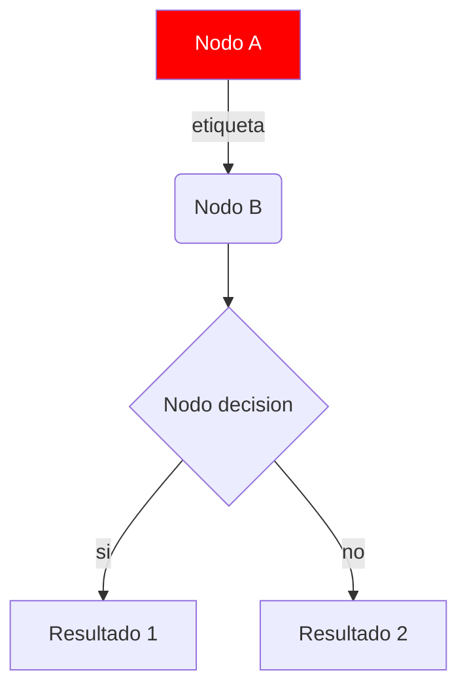
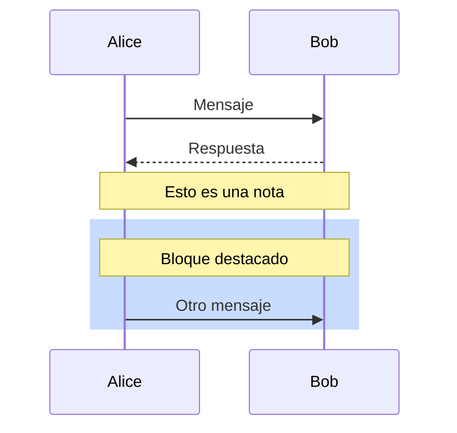

# Manual de Instrucciones: Como Regenerar y Editar los Diagramas

> Documento de respaldo. Si la generacion automatica de PNGs falla o prefieres hacerlo tu mismo a mano, sigue estas instrucciones paso a paso.

---

## Indice

1. [Como funcionan los diagramas actuales](#1-como-funcionan-los-diagramas-actuales)
2. [Opcion A: Regenerar con mermaid.ink (sin instalar nada)](#2-opcion-a-regenerar-con-mermaidink-sin-instalar-nada)
3. [Opcion B: Instalar mermaid-cli (local)](#3-opcion-b-instalar-mermaid-cli-local)
4. [Opcion C: Importar a Lucidchart](#4-opcion-c-importar-a-lucidchart)
5. [Opcion D: Importar a draw.io (gratis)](#5-opcion-d-importar-a-drawio-gratis)
6. [Opcion E: Hacer el diagrama a mano en draw.io](#6-opcion-e-hacer-el-diagrama-a-mano-en-drawio)
7. [Edicion de los archivos .mmd](#7-edicion-de-los-archivos-mmd)
8. [Troubleshooting](#8-troubleshooting)
9. [Referencia rapida de sintaxis Mermaid](#9-referencia-rapida-de-sintaxis-mermaid)

---

## 1. Como funcionan los diagramas actuales

Los 4 diagramas de arquitectura siguen el patron **"Mermaid as Source of Truth"**:

```
fuentes/01-contexto.mmd       <- Fuente editable (texto)
fuentes/02-contenedores.mmd
fuentes/03-secuencia.mmd
fuentes/04-despliegue.mmd
        |
        | (renderizado con mermaid.ink o mermaid-cli)
        v
diagrams/01-contexto.png      <- Imagen para incluir en docs/presentaciones
diagrams/01-contexto.svg      <- Vectorial, mejor calidad, editable
        |
        | (referenciados desde)
        v
arquitectura.md               <- Documento principal (Mermaid embebido)
```

**Ventaja**: editas el `.mmd`, regeneras el PNG, y todos los lugares se actualizan.

---

## 2. Opcion A: Regenerar con mermaid.ink (sin instalar nada)

**Tiempo**: 1 minuto.
**Requiere**: solo conexion a internet.

### Paso a paso

1. Abre una terminal en la raiz del proyecto
2. Ejecuta:

```bash
cd docs/02-arquitectura/fuentes

# Generar todos los PNGs
for f in *.mmd; do
  ENCODED=$(base64 -w 0 < "$f" | tr '+/' '-_' | tr -d '=')
  echo "Generando ${f%.mmd}.png..."
  curl -s -o "../diagrams/${f%.mmd}.png" "https://mermaid.ink/img/${ENCODED}?type=png&bgColor=white"
done

# Generar todos los SVGs
for f in *.mmd; do
  ENCODED=$(base64 -w 0 < "$f" | tr '+/' '-_' | tr -d '=')
  echo "Generando ${f%.mmd}.svg..."
  curl -s -o "../diagrams/${f%.mmd}.svg" "https://mermaid.ink/svg/${ENCODED}"
done

echo "Listo. Verifica:"
ls -la ../diagrams/
```

3. Si todo salio bien, veras 4 PNGs y 4 SVGs actualizados.

### Si tienes Windows (PowerShell)

```powershell
cd docs\02-arquitectura\fuentes
Get-ChildItem *.mmd | ForEach-Object {
    $content = Get-Content $_.FullName -Raw
    $bytes = [System.Text.Encoding]::UTF8.GetBytes($content)
    $encoded = [Convert]::ToBase64String($bytes).Replace('+', '-').Replace('/', '_').TrimEnd('=')
    Invoke-WebRequest -Uri "https://mermaid.ink/img/$encoded?type=png&bgColor=white" -OutFile "..\diagrams\$($_.BaseName).png"
}
```

---

## 3. Opcion B: Instalar mermaid-cli (local)

**Tiempo**: 10-15 minutos.
**Requiere**: Node.js 18+ y ~500 MB para Chromium.

### Paso a paso

1. **Instalar mermaid-cli globalmente**:

```bash
npm install -g @mermaid-js/mermaid-cli
```

2. **Verificar instalacion**:

```bash
mmdc --version
```

3. **Generar todos los diagramas**:

```bash
cd docs/02-arquitectura/fuentes

# PNG con fondo blanco, ancho 2400px
for f in *.mmd; do
  mmdc -i "$f" -o "../diagrams/${f%.mmd}.png" -w 2400 -H 1600 -b white
done

# SVG vectorial
for f in *.mmd; do
  mmdc -i "$f" -o "../diagrams/${f%.mmd}.svg"
done
```

4. **Opciones utiles de mmdc**:

```bash
# Cambiar tema
mmdc -i input.mmd -o output.png -t dark

# Cambiar tamano
mmdc -i input.mmd -o output.png -w 3000 -H 2000

# Sin fondo (transparente)
mmdc -i input.mmd -o output.png -b transparent

# Con config personalizada
mmdc -i input.mmd -o output.png -c puppeteer-config.json
```

### Troubleshooting de instalacion

Si falla la instalacion de Chromium:

```bash
# Opcion 1: Instalar Chrome manualmente
# Ubuntu/Debian:
wget https://dl.google.com/linux/direct/google-chrome-stable_current_amd64.deb
sudo dpkg -i google-chrome-stable_current_amd64.deb

# Fedora:
sudo dnf install -y chromium

# macOS:
brew install --cask google-chrome

# Opcion 2: Configurar mmdc para usar tu Chrome
cat > puppeteer-config.json << EOF
{
  "executablePath": "/usr/bin/google-chrome"
}
EOF
mmdc -i input.mmd -o output.png -p puppeteer-config.json
```

---

## 4. Opcion C: Importar a Lucidchart

**Tiempo**: 2-3 minutos por diagrama.
**Requiere**: Cuenta gratuita en Lucidchart.

### Paso a paso

1. **Ve a**: https://lucid.app
2. **Inicia sesion** (gratis con Google/GitHub/Microsoft)
3. **Nuevo documento** -> Blank
4. En el menu, busca: **Insert** -> **Diagram** -> **Mermaid**
5. **Copia y pega** el contenido del archivo `.mmd` (solo el contenido entre los ```mermaid y ```)
6. Lucidchart renderizara el diagrama automaticamente
7. **Para guardar como PNG**:
   - File -> Download As -> PNG (alta resolucion)
   - File -> Download As -> PDF (vectorial)
8. **Repetir** para cada uno de los 4 diagramas

### Ventajas de Lucidchart
- Edicion visual drag-and-drop
- Colaboracion en tiempo real
- Templates profesionales
- IA para sugerir mejoras
- Exporta a PNG, PDF, SVG

### Limitaciones de la version gratis
- 3 documentos editables
- Limite de objetos por documento
- No Custom branding

---

## 5. Opcion D: Importar a draw.io (gratis, open source)

**Tiempo**: 2 minutos por diagrama.
**Requiere**: Nada (funciona en el navegador).

### Opcion D.1: draw.io online

1. **Ve a**: https://app.diagrams.net
2. Selecciona **Device** (guardar local) o **GitHub** (si tienes repo)
3. En el menu: **Arrange** -> **Insert** -> **Advanced** -> **Mermaid**
4. **Pega** el contenido del `.mmd`
5. Click **Insert**
6. Para exportar: **File** -> **Export As** -> **PNG** (selecciona "Include a copy of my diagram")
7. Repite para cada diagrama

### Opcion D.2: draw.io desktop (recomendado)

1. **Descarga** desde https://github.com/jgraph/drawio-desktop/releases
2. **Instala** (.deb, .rpm, .dmg, .exe)
3. Abre la app, ve a **Extras** -> **Mermaid** o **+** -> **Advanced** -> **Mermaid**
4. Pega el `.mmd`, exporta

### Ventajas de draw.io
- 100% gratis, sin limites
- Open source
- Archivos .xml editables y versionables
- Exporta a PNG, SVG, PDF, XML
- Funciona offline

---

## 6. Opcion E: Hacer el diagrama a mano en draw.io

Si Mermaid te da problemas o prefieres control total, aqui las instrucciones para crear cada diagrama desde cero en draw.io.

### Diagrama 1: Contexto (C4 Nivel 1)

1. Abre draw.io, nuevo diagrama en blanco
2. **Actores** (a la izquierda):
   - Arrastra 5 formas de "Person" (cilindro con cabeza)
   - Etiquetas: Estudiante Universitario, Docente, Personal Administrativo, Coordinador de Bienestar, Director Academico
   - Color: Azul (#2563EB), texto blanco
3. **Sistema central** (al centro):
   - Rectangulo grande con doble borde
   - Etiqueta: "Sentinel AcademIA - Plataforma de Quejas con IA"
   - Color: Verde (#10B981)
4. **Sistemas externos** (a la derecha):
   - 3 cilindros o rectangulos
   - Etiquetas: Servicio de Email (Amazon SES), Servicio de SMS (Twilio), Sistema Academico Legacy
   - Color: Naranja (#F59E0B)
5. **Flechas**:
   - 5 desde actores hacia el sistema (usuarios reportan)
   - 2 desde sistema hacia externos (notificaciones)
   - 1 desde sistema hacia RegEstudiantil (consulta)
6. **Subtitulos** (subgraph):
   - "Personas de la Comunidad Universitaria" (izquierda)
   - "Autoridades Universitarias" (izquierda, debajo)
   - "Sistemas Externos" (derecha)

### Diagrama 2: Contenedores (C4 Nivel 2)

Este es el mas complejo. Estructura sugerida:

1. **Subgraph "Cliente"** (arriba, azul):
   - Caja: "Vue 3 SPA - Vite + TS + Pinia - Vercel CDN"

2. **Subgraph "AWS - us-east-1"** (centro, naranja):
   - API Gateway (caja)
   - Subgraph "AWS Lambda" con 9 cajas dentro (cada Lambda)
   - SQS, SNS, EventBridge (cajas en fila)
   - Subgraph "Storage" con DynamoDB (cilindro) y S3 (cilindro)
   - CloudWatch (caja lateral)

3. **Subgraph "Oracle OCI - us-chicago-1"** (abajo, rojo):
   - OCI Generative AI (caja)
   - OCI Document Understanding (caja)
   - OCI Vault (caja)

4. **Flechas** (numerosas):
   - Cliente -> API Gateway
   - API Gateway -> cada Lambda relevante
   - Lambdas -> DynamoDB / SQS / S3 / OCI
   - OCI -> DynamoDB (respuesta)
   - EventBridge -> SNS, Lambdas consumers

### Diagrama 3: Secuencia

Mejor hacer este en Mermaid o usar una herramienta especializada (excalidraw, Whimsical). En draw.io seria muy laborioso.

**Recomendacion**: usa el `.mmd` existente y renderiza con cualquier opcion anterior.

### Diagrama 4: Despliegue

Similar al de contenedores pero con foco en:

1. **Subgraph "Internet"** (gris)
2. **Subgraph "Edge - Vercel CDN"** (azul)
3. **Subgraph "AWS us-east-1"** (naranja, con multi-AZ notado)
4. **Subgraph "OCI us-chicago-1"** (rojo)
5. Anotaciones de latencia entre nodos (ej: "~50ms", "~100ms")

---

## 7. Edicion de los archivos .mmd

### Estructura basica



### Tipos de nodos

| Sintaxis | Forma | Uso |
|---|---|---|
| `A[texto]` | Rectangulo | Componentes, servicios |
| `A(texto)` | Rectangulo redondeado | APIs, handlers |
| `A((texto))` | Circulo | Inicio/fin |
| `A{texto}` | Rombo | Decision |
| `A[[texto]]` | Subroutine | Procesos |
| `A[(texto)]` | Cilindro | Bases de datos |
| `A>texto]` | Asimetrico | Input |
| `A([texto])` | Stadium | Output |

### Direccion del grafo

```mermaid
graph TB    %% Top -> Bottom (arriba a abajo)
graph BT    %% Bottom -> Top
graph LR    %% Left -> Right (izquierda a derecha)
graph RL    %% Right -> Left
```

### Estilos (classDef)

```mermaid
classDef primary fill:#2563EB,stroke:#1E40AF,color:#fff,stroke-width:2px
classDef success fill:#10B981,stroke:#059669,color:#fff
classDef warning fill:#F59E0B,stroke:#D97706,color:#fff
classDef danger fill:#EF4444,stroke:#B91C1C,color:#fff

class Nodo1 primary
class Nodo2,Nodo3 success
```

### Subgraphs (agrupar nodos)

```mermaid
subgraph NombreGrupo["Titulo Visible"]
    A --> B
    B --> C
end
```

### Diagramas de secuencia



---

## 8. Troubleshooting

### "Mermaid syntax error"

Mermaid es estricto con la sintaxis. Errores comunes:

| Error | Causa | Solucion |
|---|---|---|
| `Expecting 'NODE', got 'TEXT'` | Caracteres especiales en etiquetas | Comillas: `A["texto con espacios"]` |
| `Lexical error` | Parentesis sin cerrar | Revisa todos los `(` y `)` |
| `Unknown diagram type` | `graph` mal escrito | Usar `graph`, `flowchart`, `sequenceDiagram` |
| `Subgraph contains invalid syntax` | `end` faltante | Todo `subgraph` debe cerrar con `end` |

### "El PNG sale en blanco"

Causa: error de sintaxis que Mermaid no detecta bien.

**Solucion**: Validar primero en https://mermaid.live (editor online).

### "Los colores no se aplican"

Causa: `classDef` mal referenciado o sintaxis incorrecta.

**Solucion**:
```mermaid
classDef miEstilo fill:#FF0000,color:#fff
class MiNodo miEstilo   %% Sin comas, separado por espacios
```

### "No se ve la imagen en GitHub"

Causa: GitHub renderiza bloques `mermaid` solo en archivos `.md`. En otros archivos no funciona.

**Solucion**:
- En `.md`: usar ```mermaid (que ya esta en `arquitectura.md`)
- En `.tex` (LaTeX): incluir como `\includegraphics{diagrams/01-contexto.png}`

### "Quiero hacer el diagrama en PowerPoint/Keynote"

**Opcion 1**: Exporta el PNG/SVG desde draw.io o mermaid-cli, luego inserta en PowerPoint.

**Opcion 2**: Usa una plantilla C4:
- https://structurizr.com/ (C4 oficial)
- https://www.c4model.com/

---

## 9. Referencia rapida de sintaxis Mermaid

```mermaid
%% Tipos de diagrama
graph TB              %% Top-Bottom
graph LR              %% Left-Right
sequenceDiagram       %% Secuencia
classDiagram          %% Clases UML
stateDiagram-v2       %% Estados
erDiagram             %% Entidad-Relacion
gantt                 %% Gantt
pie                   %% Pie chart

%% Conexiones
A --> B               %% Flecha simple
A -->|texto| B        %% Flecha con etiqueta
A --- B               %% Linea
A -.-> B              %% Flecha punteada
A ==> B               %% Flecha gruesa
A -- texto --- B      %% Linea con texto

%% Estilos de flecha
A --> B
A --texto--> B
A -.texto.-> B
A ==texto==> B

%% Agrupacion
subgraph id["Titulo"]
    A
    B
end

%% Hipervinculos
A --> B
click A "https://ejemplo.com" "Tooltip"

%% Notas (solo en sequence)
Note over A,B: Texto de la nota
Note left of A: Nota a la izquierda
```

---

## Resumen: Que metodo elegir

| Si quieres... | Usa... |
|---|---|
| Rapido y sin instalar nada | Opcion A (mermaid.ink) |
| Calidad profesional, control total | Opcion B (mermaid-cli) |
| Editar visualmente y colaborar | Opcion C (Lucidchart) |
| Gratis, open source, offline | Opcion D (draw.io) |
| Hacer desde cero a mano | Opcion E (draw.io manual) |
| PowerPoint/Keynote | Exporta PNG/SVG de cualquiera |

**Recomendacion para la hackaton**: usa Opcion A para empezar rapido, y si tienes tiempo, refina los diagramas en draw.io (Opcion D) para mejor presentacion.

---

## Archivos del proyecto

```
docs/02-arquitectura/
├── arquitectura.md                 # Documento principal (con Mermaid embebido)
├── manual-instrucciones.md         # Este archivo
├── diagrams/                       # Imagenes exportadas
│   ├── 01-contexto.png
│   ├── 01-contexto.svg
│   ├── 02-contenedores.png
│   ├── 02-contenedores.svg
│   ├── 03-secuencia.png
│   ├── 03-secuencia.svg
│   ├── 04-despliegue.png
│   └── 04-despliegue.svg
└── fuentes/                        # Fuentes Mermaid editables
    ├── 01-contexto.mmd
    ├── 02-contenedores.mmd
    ├── 03-secuencia.mmd
    └── 04-despliegue.mmd
```
