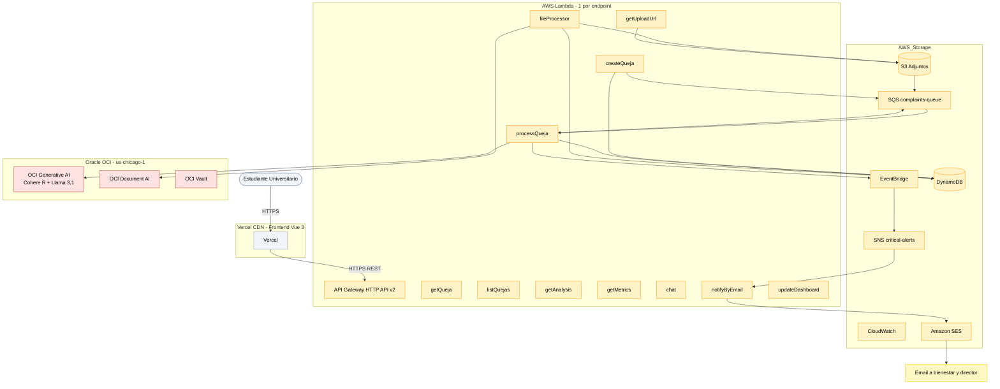

# Super Prompt para Lucidchart (Lucid AI)

> Copia y pega este prompt completo en Lucidchart (cuando tengas un documento nuevo, click en el menu "Insert" -> "Diagram" -> "Mermaid" o usa Lucid AI).
> Lucidchart te generara un diagrama profesional con los iconos oficiales de AWS y Oracle.

---

## El Prompt (copia todo)

```
Crea un diagrama de arquitectura profesional, multi-nube y detallado para una aplicacion serverless llamada "Sentinel AcademIA". El diagrama debe mostrar el flujo end-to-end de como un estudiante universitario envia una queja y como es procesada por IA generativa.

REQUISITOS VISUALES:
- Orientacion: Top-Down (de arriba hacia abajo)
- Estilo: Profesional, moderno, con iconos oficiales de servicios
- Colores por region: 
  - Cliente/Edge: gris claro (#F1F5F9)
  - AWS region: naranja suave (#FEF3C7) con bordes naranjas (#FF9900)
  - OCI region: rojo suave (#FEE2E2) con bordes rojos (#C74634)
  - Alertas/notificaciones: amarillo suave (#FEF9C3)
- Iconos: USA los iconos oficiales de AWS y Oracle (AWS: estilo naranja, Oracle: estilo rojo)
- Labels: claros, en espanol, sin acronimos raros
- Flechas: gruesas para flujo principal, finas para dependencias

ESTRUCTURA DEL DIAGRAMA (de arriba a abajo):

NIVEL 1: CLIENTE (gris)
- Icono: "Web Browser" o "User"
- Label: "Estudiante Universitario"
- Flecha hacia abajo con label "HTTPS"

NIVEL 2: EDGE NETWORK (gris)
- Icono: Vercel (logo)
- Label: "Vercel CDN"
- Sub-label: "Frontend Vue 3 - TypeScript"
- Flecha hacia abajo con label "HTTPS REST API"

NIVEL 3: AWS API GATEWAY (naranja)
- Icono: AWS API Gateway
- Label: "AWS API Gateway"
- Sub-label: "HTTP API v2 - 1 region us-east-1"
- Flecha hacia abajo

NIVEL 4: AWS LAMBDA FUNCTIONS (naranja, agrupados en un recuadro)
- Titulo del grupo: "AWS Lambda - 1 por endpoint (Node.js 20 - TypeScript)"
- 9 iconos Lambda (uno por cada uno):
  1. Label: "createQueja" - Sub: "POST /api/quejas"
  2. Label: "getQueja" - Sub: "GET /api/quejas/:id"
  3. Label: "listQuejas" - Sub: "GET /api/quejas"
  4. Label: "getAnalysis" - Sub: "GET /api/quejas/:id/analysis"
  5. Label: "getMetrics" - Sub: "GET /api/dashboard/metrics"
  6. Label: "chat" - Sub: "POST /api/chat"
  7. Label: "getUploadUrl" - Sub: "POST /api/uploads/presigned"
  8. Label: "processQueja" - Sub: "Consumer SQS"
  9. Label: "fileProcessor" - Sub: "Consumer SQS (S3 events)"
  10. Label: "notifyByEmail" - Sub: "Consumer SNS"
  11. Label: "updateDashboard" - Sub: "Consumer EventBridge"

NIVEL 5: AWS STORAGE & QUEUES (naranja, agrupados)
Tres columnas:

COLUMNA IZQUIERDA - COLAS Y EVENTOS:
- Icono: SQS
  - Label: "SQS: complaints-queue"
  - Sub: "Standard queue con DLQ"
- Flecha: SQS -> Lambda processQueja
- Icono: SNS
  - Label: "SNS: critical-alerts"
  - Sub: "Topic para alertas"
- Flecha: SNS -> Lambda notifyByEmail
- Icono: EventBridge
  - Label: "EventBridge"
  - Sub: "Bus de eventos"
- Flecha: EventBridge -> SNS

COLUMNA CENTRO - STORAGE:
- Icono: DynamoDB
  - Label: "DynamoDB"
  - Sub: "Tabla unica: quejas, metricas, idempotencia"
  - Multiples flechas bidireccionales desde varias Lambdas
- Icono: S3
  - Label: "S3: Adjuntos"
  - Sub: "Archivos PDF/imagenes subidos"
  - Flecha: S3 -> SQS (via Event Notification)
  - Flecha: Lambda getUploadUrl -> S3 (escribir)
  - Flecha: Lambda fileProcessor -> S3 (leer)

COLUMNA DERECHA - OBSERVABILIDAD:
- Icono: CloudWatch
  - Label: "CloudWatch"
  - Sub: "Logs + Metricas + X-Ray"
- Icono: SES
  - Label: "Amazon SES"
  - Sub: "Servicio de email"
- Flecha: Lambda notifyByEmail -> SES -> Email destino

NIVEL 6: ORACLE OCI (rojo, agrupado en recuadro)
- Titulo: "Oracle OCI - Region us-chicago-1"
- Icono: OCI Generative AI
  - Label: "OCI Generative AI"
  - Sub: "Primary: Cohere Command R"
  - Sub2: "Fallback: Meta Llama 3.1 70B"
- Icono: OCI Document Understanding
  - Label: "OCI Document AI"
  - Sub: "Llama 3.2 90B Vision"
- Icono: OCI Vault
  - Label: "OCI Vault"
  - Sub: "Secretos criticos"
- Flecha: Lambda processQueja -> OCI Generative AI (HTTPS cross-region)
- Flecha: Lambda fileProcessor -> OCI Document Understanding (HTTPS)
- Flecha: Lambdas -> OCI Vault (para secrets)

NIVEL 7: NOTIFICACIONES (amarillo, al lado derecho del nivel 4-5)
- Icono: Email envelope
  - Label: "Email a bienestar@universidad.edu"
- Icono: Email envelope
  - Label: "Email a director@universidad.edu"
- (Opcional) Icono: SMS
  - Label: "SMS a numeros de emergencia"

LEYENDA (esquina inferior derecha):
- Recuadro naranja: AWS Services
- Recuadro rojo: OCI Services
- Recuadro gris: Cliente/Edge
- Recuadro amarillo: Notificaciones
- Texto: "Latencia cross-region AWS <-> OCI: ~80ms"
- Texto: "Tiempo end-to-end queja -> alerta critica: < 1 minuto"

ANNOTACIONES (textos flotantes en el diagrama):
1. Cerca de createQueja: "Sincronico - responde 202 en <500ms"
2. Cerca de processQueja: "Asincronico - circuit breaker + fallback entre 3 modelos"
3. Cerca de DynamoDB: "PAY_PER_REQUEST - multi-AZ"
4. Cerca de SQS: "VisibilityTimeout 6x Lambda timeout - DLQ en 3 intentos"
5. Cerca de EventBridge: "Reglas: criticidad=CRITICA -> SNS"
6. Cerca de OCI GenAI: "$0.50/$1.50 por 1M tokens (vs $3/$15 Claude)"
7. Cerca del flujo: "Circuit Breaker + Idempotencia + Rate Limiting en cada llamada"

ESTILO FINAL:
- Background: blanco o gris muy claro
- Texto principal: negro (#0F172A)
- Sub-textos: gris (#64748B)
- Bordes: 1-2px, redondeados
- Sombras sutiles en los recuadros
- Iconos de servicios del tamao estandar (no gigantes)
- Espaciado uniforme entre niveles
- Agrupar servicios relacionados en recuadros con titulo

IMPORTANTE:
- El diagrama debe poder leerse de arriba a abajo
- Cada nivel debe estar claramente separado
- Los iconos de AWS y Oracle son CRITICOS - no los sustituyas por rectangulos genericos
- Los labels deben ser especificos (no solo "Lambda" sino "Lambda createQueja")
- Las flechas deben tener direccion clara
- El flujo de notificacion de email debe verse claramente como una rama lateral
- El flujo de upload de archivos (presigned URL) debe verse claramente
```

---

## Como usar este prompt

### Opcion 1: Lucidchart (recomendado)

1. Ve a https://lucid.app
2. Crea un nuevo documento
3. En el menu, busca **"Insert" > "Diagram"** o usa **"Lucid AI"**
4. Pega el prompt completo
5. Lucidchart generara un diagrama con los iconos oficiales

### Opcion 2: Mermaid (alternativa gratuita)

Si no tienes Lucidchart, convierte el prompt a Mermaid:



Para regenerarlo:
```bash
# Fuente Mermaid: docs/02-arquitectura/fuentes/05-flujo-completo.mmd
# Ya tienes el script: bash scripts/regenerate-diagrams.sh
```

---

## Tips para el prompt

1. **Se especifico con los servicios**: Lucidchart AI funciona mejor cuando le dices exactamente que servicios usar.

2. **Menciona "iconos oficiales"**: Esto fuerza a Lucidchart a buscar los iconos reales de AWS y Oracle en su libreria.

3. **Especifica el flujo visual**: "Top-Down" o "Left-Right" ayuda a Lucidchart a entender la orientacion.

4. **Incluye anotaciones**: Lucidchart AI a veces agrega callouts si le pides "annotations" o "notes".

5. **Pide colores especificos**: "#FF9900" es el naranja oficial de AWS. Si lo especificas, Lucidchart lo respetara.

6. **Iterar**: Si el primer resultado no es perfecto, ajusta el prompt y regenera.

---

## Variantes del prompt

### Variante minimalista (si el detallado es demasiado)

```
Crea diagrama de arquitectura multi-nube para "Sentinel AcademIA".

Cliente: Estudiante -> Vercel (Frontend Vue 3)
AWS us-east-1: API Gateway -> 11 Lambdas -> DynamoDB + S3 + SQS + SNS + EventBridge + CloudWatch + SES
OCI us-chicago-1: Generative AI (Cohere R + Llama 3.1) + Document AI + Vault

Flujo:
1. Estudiante sube queja
2. Lambda createQueja valida y encola
3. Lambda processQueja llama a OCI GenAI
4. Si criticidad=CRITICA: EventBridge -> SNS -> Lambda notifyByEmail -> SES -> Email

Usa iconos oficiales de AWS y Oracle. Colores: naranja para AWS, rojo para OCI.
```

### Variante para import a draw.io

Si prefieres draw.io (gratis), importa el prompt anterior y Lucidchart te dara el .xml compatible.

---

## Errores comunes

- "El diagrama se ve plano" -> Agrega "con sombras sutiles" o "con efecto 3D"
- "Los iconos son cuadrados en vez de los oficiales" -> Especifica "iconos estilo AWS" o "iconos oficiales de AWS Architecture"
- "No se entiende el flujo" -> Agrega mas labels a las flechas (ej: "HTTPS", "ASYNC", "SQS Event")
- "Faltan servicios" -> Revisa que listaste todos los explicitamente
- "El texto se superpone" -> Pide "texto sin overlap" o "espaciado amplio"
